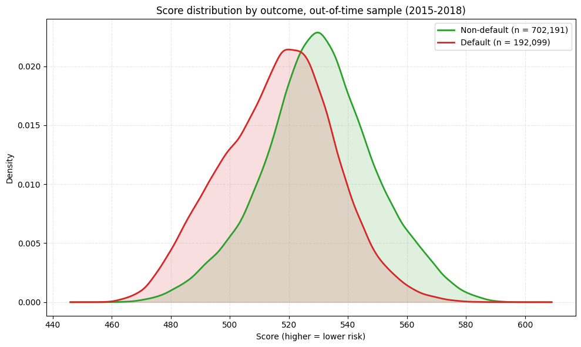
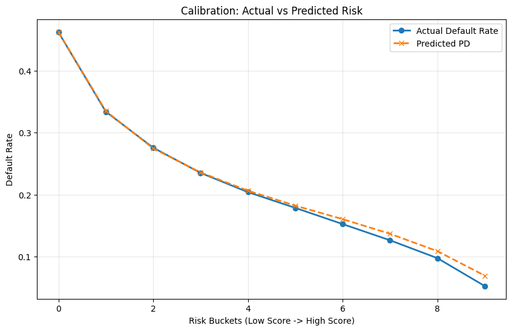

# Credit risk scorecard on LendingClub loans

A side project where I built a probability-of-default scorecard on about 1.35 million LendingClub loans (2007–2018). I tried to follow roughly how banks build these models for regulatory use: an interpretable logistic regression on binned variables, tested on later loans the model never saw, and calibrated conservatively.

Everything is in one notebook: `credit_scorecard.ipynb`.

## Data

The loan data is the [LendingClub dataset on Kaggle](https://www.kaggle.com/datasets/wordsforthewise/lending-club) (`accepted_2007_to_2018Q4.csv.gz`). It's too big for GitHub, so download it and put it in `data/raw/`. The data dictionary is included in `metadata/`.

Before modelling, I:

- checked every column against LendingClub's data dictionary. One variable had a different name in the two (`verified_status_joint` vs `verification_status_joint`), which I fixed;
- kept only closed loans (1,348,099), and counted charged-off or defaulted loans as defaults (about 20%). This is a shortcut with a real cost, see below;
- left out LendingClub's own grade and interest rate, so the model can't just copy the lender's assessment.

I didn't use the rejected applications. That's a limitation, not a design choice (see below).

## What the notebook does

1. Trains on loans issued before 2015 and tests on 2015–2018 loans.
2. Builds about 1,560 candidate features from products and ratios of the 40 base variables, and screens them by information value (on training loans only).
3. Bins every variable into monotonic bins with weight of evidence, with missing values kept as their own bin.
4. Drops near-duplicate and highly collinear variables.
5. Picks variables with an L1-penalised logistic regression.
6. Calibrates the average PD to the long-run default rate plus a 5-point safety margin, and scales it to a score (600 points at 50:1 odds, 20 points to double the odds).

## Results on the 2015–2018 loans (894,290 loans)

| | |
|---|---|
| AUC | 0.694 |
| Gini | 0.388 |
| KS | 0.277 |
| PSI, train vs test | 0.002 |
| Largest gap between predicted and actual default rate, by score decile | 1.7 points |

The model ranks borrowers moderately well, which is about what you'd expect without the lender's own grade. The scores are very stable over time, and calibration holds up well. Later loans defaulted more often in the data than earlier ones (21.5% against 17.5%), so the safety margin kept the average PD close to reality. But part of that jump is probably caused by how I built the sample (see below), so I wouldn't read too much into it.





## Limitations and what I'd do next

The two biggest problems are about which loans end up in the data:

- **Censoring.** The data stops in December 2018, and I kept only loans that had already closed. Many 2015–2018 loans were still running, so their outcome is censored. The recent loans that had closed are mostly the ones that defaulted or were repaid early, which biases the default rate in the test period, probably upwards. The fix I'd make next: define default as "defaulted within 12 months of issue" and keep every loan issued at least 12 months before the data ends, including those still running. Then every outcome is fully observed, and it matches the 12-month horizon regulatory models use. A time-to-default (hazard) model would be the alternative.
- **Sample selection.** The model only sees loans LendingClub approved, so it learns risk among borrowers who passed LendingClub's own screening, and will likely underestimate risk for the kind of applicants it rejected. The rejected applications are in the dataset. Using them (reject inference, or a selection model for acceptance and default together) would be the next step after that.

Smaller points:

- The long-run average only covers 2007–2014, which isn't a full economic cycle.
- Cross-validation folds are random. Splitting them by year would be a stricter test.

## Running it

```
pip install -r requirements.txt
jupyter notebook credit_scorecard.ipynb
```

Then run all cells.
